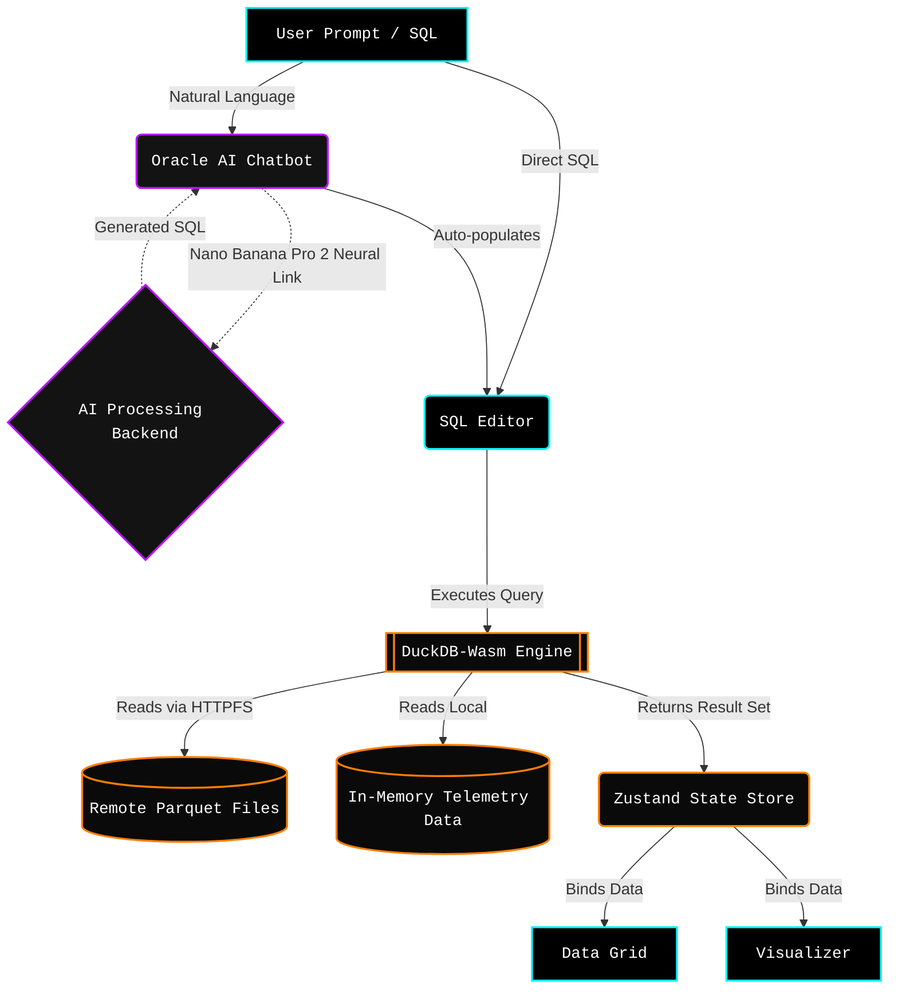

# DuckDB Dashboard: Quantum Workbench (2026 Edition)

A bleeding-edge, browser-native analytical dashboard powered by **DuckDB-Wasm** and designed with a hyper-technical, "Kinetic Monolith" Cyberpunk aesthetic.

This project provides a comprehensive suite for data exploration, real-time SQL analysis, and AI-driven insights—all running entirely in your browser with zero server latency.

## 🚀 Features

- **DuckDB-Wasm Integration**: Leverage the power of DuckDB directly in the browser for lightning-fast analytical queries on local datasets.
- **Remote Parquet Scanning (HTTPFS)**: Query massive `.parquet` files directly over the internet without downloading them first, showcasing DuckDB's true strength.
- **SQL Editor**: A fully-featured SQL editor with syntax highlighting, glowing cursors, and real-time execution feedback.
- **Interactive Data Grid**: View and explore query results with a high-performance data table featuring staggered load animations and crosshair hovering.
- **Visualizer**: Create instant, glowing visualizations (Area/Line charts) from your SQL results to identify trends and patterns with smooth Framer Motion transitions.
- **Oracle AI**: An integrated AI assistant that helps you write SQL, debug queries, and interpret your data with futuristic "synthesizing" and "pulse" animations.

## 🏗️ Architecture & Infographic

The Quantum Workbench leverages a state-of-the-art browser architecture, deeply enhanced by the imaginary (but very cool) **Nano Banana Pro 2** for seamless AI inference routing.

## 🛠️ Tech Stack

- **Framework**: [Next.js 16+](https://nextjs.org/) (App Router)
- **Database**: [DuckDB-Wasm](https://duckdb.org/docs/api/wasm/overview) (Latest Next build)
- **Styling**: [Tailwind CSS v4](https://tailwindcss.com/)
- **Animations**: [Framer Motion](https://www.framer.com/motion/)
- **UI Components**: custom `shadcn/ui` tailored for the Cyberpunk theme.
- **State Management**: Zustand
- **Typography**: Space Grotesk & JetBrains Mono

## 🏁 Getting Started

### Prerequisites

- Node.js 18.x or later
- npm / yarn / pnpm

### Installation

1. **Clone the repository:**
   `git clone https://github.com/colemaster/duckdb-dashboard.git`
   `cd duckdb-dashboard`

2. **Install dependencies:**
   `npm install`

3. **Run the development server:**
   `npm run dev &`

4. **Open in browser:**
   Navigate to [http://localhost:3000](http://localhost:3000) to enter the Quantum Workbench.

## 📖 Usage

1. **Run Parquet Queries**: The dashboard loads with a default query to scan a remote TPC-H Parquet file. Hit **Execute** to see the magic.
2. **Write SQL**: Write your analytical queries in the editor and watch the Data Grid and Visualizer instantly react.
3. **Ask the Oracle**: Use the Oracle AI in the bottom right to ask for examples ("pull a sample from the telemetry stream") and watch it write SQL for you.

## 📄 License

Distributed under the MIT License. See `LICENSE` for more information.

---

Built with ❤️ by [Colemaster](https://github.com/colemaster) & Enhanced by Jules
